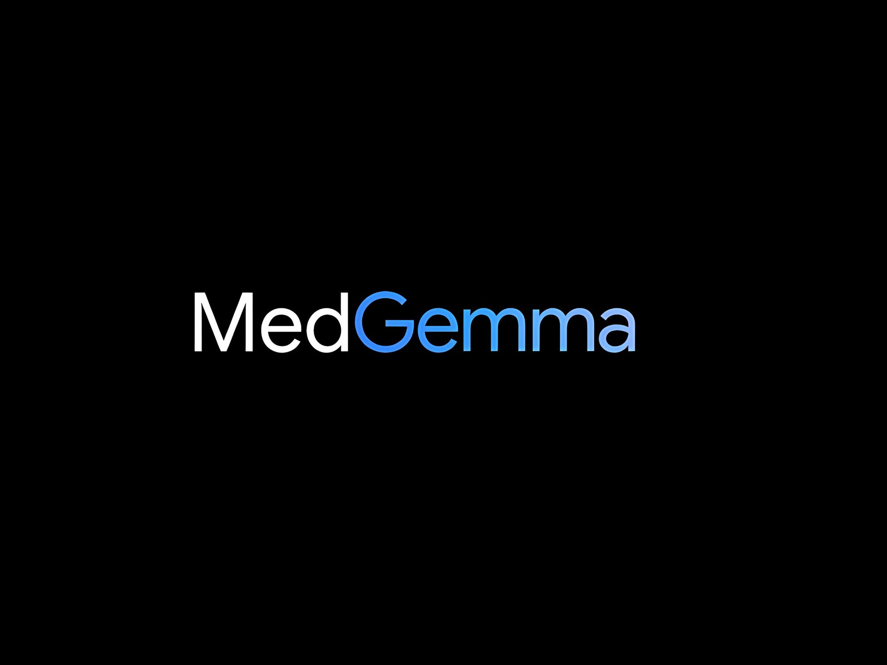

# Med Gemma - Medical Multimodal Chatbot (Radiology)

Med Gemma is a medical chatbot based on the `alibayram/medgemma:latest` language model, accessible via a Chainlit interface. Note: The used model is text-to-text only. On M-Series Mac or eventually PC with GPU Accelerator, I recommend to install [LM Studio](https://lmstudio.ai) and choose a multimodal model in GGUF-Format or mlx 4 bit vision for Mac or similar to recognize radiology images. Medgemma from google is the first multimodal model with its minimalistic size of 4B parameters. It might be only capable of performing easy radiology tasks I guess. Check [ollama medgemma vision](https://ollama.com/search?q=medgemma). Because in the meanwhile new vision models of medgemma are available on ollama model search. You might want to use one of those instead, although at the time, ollama and chainlit don't seem to support processing vision / images.

## Prerequisites

Before you begin, ensure that Ollama is installed and running.

1.  **Install Ollama:**
    Visit [ollama.com](https://ollama.com/download) and download the version for your operating system.

2.  **Download the MedGemma Model:**
    Open your terminal and run the following command to download the specific model:
    ```bash
    ollama pull alibayram/medgemma:latest
    ```
    Ensure the Ollama service is running in the background before starting the application.

## Installation

You can install the project dependencies using either Conda or pip.

### Option 1: Using Conda

1.  **Create a new Conda environment (recommended):**
    ```bash
    conda create -n medgemma python=3.10  # You can choose a different Python version if desired
    conda activate medgemma
    ```

2.  **Install dependencies:**
    Create a `requirements.txt` file (if not already present) with the following content:
    ```txt
    // filepath: requirements.txt
    chainlit
    langchain
    langchain-community
    ollama
    ```
    Then install the packages:
    ```bash
    pip install -r requirements.txt
    ```
    *(Note: Although we are using Conda, `pip` within a Conda environment is often the easiest way to install Python packages that are not directly available as Conda packages or to use specific versions from `requirements.txt`.)*

### Option 2: Using pip

1.  **Create a virtual environment (recommended):**
    ```bash
    python -m venv venv
    source venv/bin/activate  # On macOS/Linux
    # venv\Scripts\activate  # On Windows
    ```

2.  **Install dependencies:**
    Create a `requirements.txt` file (if not already present) with the following content:
    ```txt
    // filepath: requirements.txt
    chainlit
    langchain
    langchain-community
    ollama
    ```
    Then install the packages:
    ```bash
    pip install -r requirements.txt
    ```

## Running the Application

1.  **Ensure your (Conda or virtual) environment is activated.**
2.  **Ensure the Ollama service is running and the `alibayram/medgemma:latest` model is available.**
3.  **Navigate to the project directory in your terminal.**
4.  **Start the Chainlit application:**
    ```bash
    chainlit run main.py -w
    ```
    The `-w` flag enables automatic reloading on code changes.

## Accessing the Chat in the Browser

After starting the application, you will see output in the terminal similar to this:

```
Your app is available at http://localhost:8000
```

Open your web browser and navigate to the displayed address (defaults to `http://localhost:8000`, but may vary if the port is already in use). You should now see the Med Gemma chat interface.
